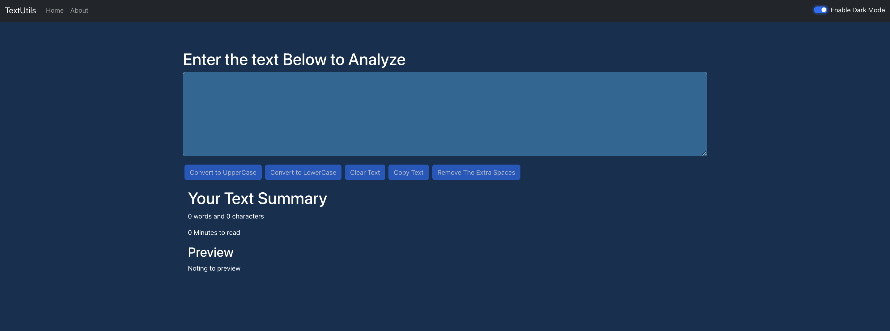

# TEXTUTILS

TEXTUTILS is a React-based web application designed to provide users with various text manipulation utilities, such as converting text to uppercase or lowercase, removing extra spaces, and more.



## Features

- **Text Transformation:** Convert text to uppercase or lowercase.
- **Whitespace Management:** Remove extra spaces from text.
- **Word and Character Count:** Display the number of words and characters in the input text.
- **Preview Text:** Preview the modified text in real-time.
- **Dark Mode Support:** Toggle between light and dark themes for better readability.

## Technologies Used

- **Frontend:** React.js
- **Styling:** CSS

## Installation

To run this project locally:

1. **Clone the repository:**
   ```bash
   git clone https://github.com/MAHARSHIBHOWMICK/TEXTUTILS.git
   ```

2. **Navigate to the project directory:**
   ```bash
   cd TEXTUTILS
   ```

3. **Install dependencies:**
   ```bash
   npm install
   ```

4. **Start the development server:**
   ```bash
   npm start
   ```

   The application will be running at `http://localhost:3000`.

## Usage

1. **Enter Text:** Input the text you want to manipulate into the provided textarea.
2. **Choose Operation:** Select the desired text operation (e.g., convert to uppercase, remove extra spaces).
3. **View Results:** The transformed text will be displayed, along with statistics like word and character count.

## Contributing

Contributions are welcome! If you'd like to enhance the application or add new features, please fork the repository and submit a pull request with your changes.

## License

This project is licensed under the [MIT License](LICENSE).

## Acknowledgements

- This project was bootstrapped with [Create React App](https://github.com/facebook/create-react-app).


